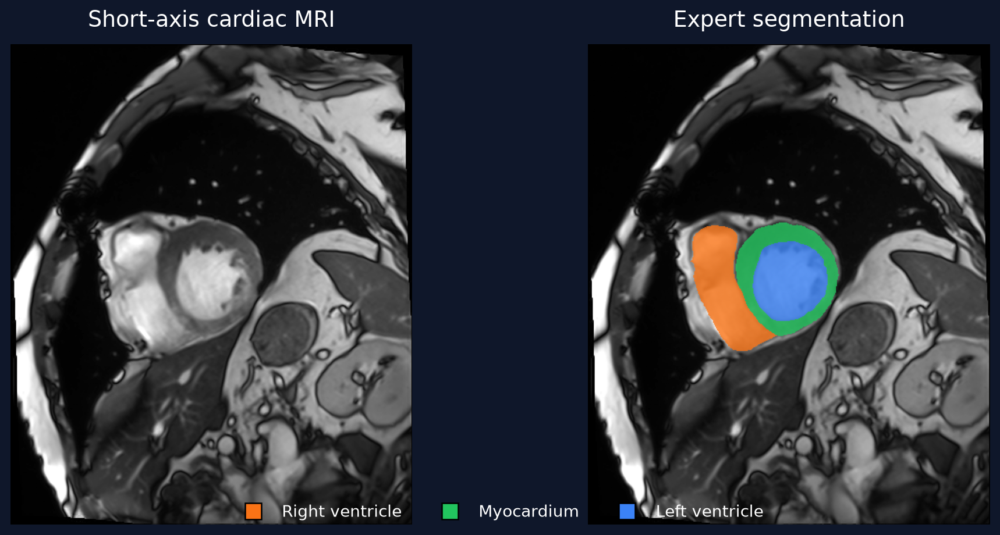
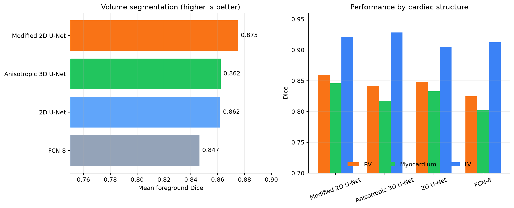

# Cardiac MRI Segmentation on ACDC

An end-to-end PyTorch reproduction of 2D and 3D convolutional networks for segmenting the right ventricle, myocardium, and left ventricle in short-axis cardiac MRI.



## Highlights

- Recreated FCN-8, 2D U-Net, a parameter-efficient modified 2D U-Net, and an anisotropic 3D U-Net from the architecture study by [Baumgartner et al.](https://arxiv.org/abs/1709.04496).
- Built a spacing-aware NIfTI-to-HDF5 preprocessing pipeline for both 2D and 3D training.
- Used patient-level train/validation separation to prevent slices from the same patient leaking across splits.
- Reconstructed complete volumes before evaluating 2D predictions.
- Evaluated foreground Dice by anatomical structure and applied   largest-connected-component post-processing.

## Results

The modified 2D U-Net trained with weighted cross-entropy achieved the best mean foreground Dice: **0.875**. The anisotropic 3D U-Net achieved **0.862** mean Dice and the strongest left-ventricle score: **0.928**.

| Model | Mean Dice | RV Dice | Myocardium Dice | LV Dice | Mean ASSD | Mean HD |
|---|---:|---:|---:|---:|---:|---:|
| **Modified 2D U-Net (weighted CE)** | **0.875** | **0.859** | **0.846** | 0.921 | 0.878 | 7.648 |
| Anisotropic 3D U-Net | 0.862 | 0.841 | 0.817 | **0.928** | **0.431** | **5.460** |
| 2D U-Net | 0.862 | 0.848 | 0.833 | 0.905 | 1.421 | 8.332 |
| FCN-8 | 0.847 | 0.825 | 0.802 | 0.912 | 0.749 | 7.605 |





## Method

```text
ACDC NIfTI
    │
    ├── metadata-preserving HDF5 conversion
    │
    ├── 2D: resample in-plane → normalize → crop/pad → slices
    │       └── FCN-8 / 2D U-Net / modified 2D U-Net
    │
    └── 3D: resample volume → normalize → crop/pad
            └── anisotropic 3D U-Net

Predictions → largest component per class → volume-level Dice / ASSD / HD
```

The 3D model pools through-plane only once and then pools in-plane, reflecting the lower through-plane resolution of the source MRI. The modified 2D U-Net keeps transposed-convolution outputs narrow before combining them with encoder features.

## Quick start

```bash
python -m venv .venv
source .venv/bin/activate
pip install -r requirements-dev.txt
pytest
```

Download ACDC from the
[official challenge website](https://www.creatis.insa-lyon.fr/Challenge/acdc/index.html),
place it under `ACDC/database`, and follow
[`docs/REPRODUCING.md`](docs/REPRODUCING.md) for preprocessing, training, and
evaluation commands.

## Repository structure

```text
models/       PyTorch implementations of the four architectures
scripts/      Conversion, preprocessing, training, and evaluation entry points
notebooks/    Curated experiment evaluation and training-curve analysis
runs/         Selected configurations, histories, and volume-level metrics
results/      Compact machine-readable result tables
tests/        Model-shape and metric regression tests
docs/         Reproduction guide and portfolio figures
```

## Dataset and references

This project uses the
[Automatic Cardiac Diagnosis Challenge](https://www.creatis.insa-lyon.fr/Challenge/acdc/index.html) dataset. The repository does not redistribute medical images or model checkpoints.

- O. Bernard et al., “Deep Learning Techniques for Automatic MRI Cardiac
  Multi-structures Segmentation and Diagnosis: Is the Problem Solved?” *IEEE Transactions on Medical Imaging*, 2018.
  [doi:10.1109/TMI.2018.2837502](https://doi.org/10.1109/TMI.2018.2837502)
- C. F. Baumgartner et al., “An Exploration of 2D and 3D Deep Learning Techniques for Cardiac MR Image Segmentation,” 2017.
  [arXiv:1709.04496](https://arxiv.org/abs/1709.04496)


## License

Code is released under the [MIT License](LICENSE). The ACDC dataset remains subject to its own terms.
