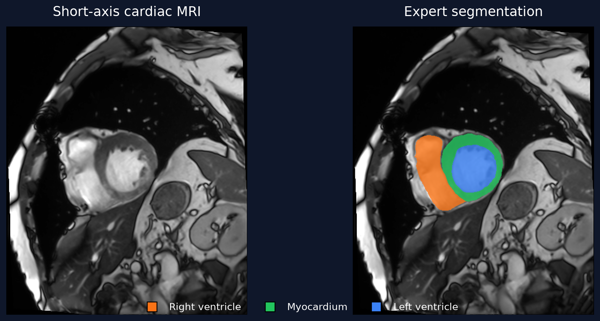
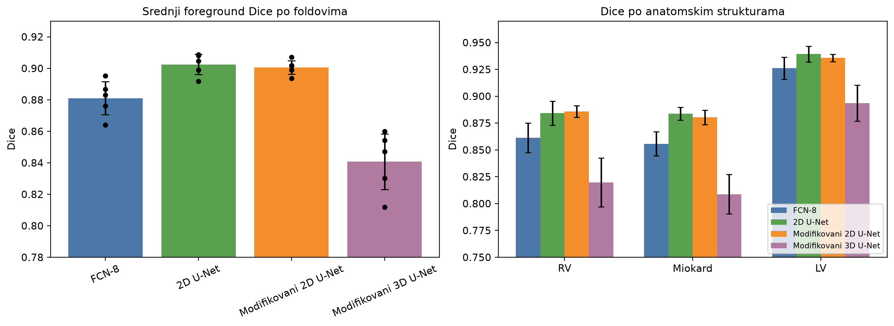

# Cardiac MRI Segmentation on ACDC

An end-to-end PyTorch implementation of four convolutional networks for
segmenting the right ventricle (RV), myocardium (Myo), and left ventricle (LV)
in short-axis cardiac MRI.



## Current project status

The completed experiment uses deterministic, diagnosis-stratified five-fold
cross-validation at patient level. The 100 ACDC training patients are split
into five folds of 80 training and 20 validation patients; each validation fold
contains four patients from each diagnostic group. Patients 101–150 are kept
separate for final local evaluation of five-model ensembles.

The implemented models are:

- FCN-8;
- standard 2D U-Net;
- modified 2D U-Net with narrow four-channel transposed convolutions; and
- anisotropic 3D U-Net, which reduces through-plane resolution only once.

Preprocessing preserves physical spacing and other NIfTI metadata. Final
metrics are calculated on complete reconstructed volumes after retaining the
largest connected component of each foreground class.

The current report is [`report/izvestaj_cv.pdf`](report/izvestaj_cv.pdf). Its
source is [`report/izvestaj_cv.tex`](report/izvestaj_cv.tex).

## Results

The standard 2D U-Net gives the best mean cross-validation result and the best
five-model ensemble result. The modified 2D U-Net is close while using
5,856,272 fewer parameters, approximately 18.9% fewer than the standard model.

### Five-fold validation

Values are the mean and population standard deviation across five validation
folds. Each fold contains 40 reconstructed ED/ES volumes from 20 patients.

| Model | Mean Dice | Mean ASSD (mm) | Mean HD (mm) |
|---|---:|---:|---:|
| FCN-8 | 0.8810 ± 0.0105 | 0.9210 ± 0.1699 | 11.8831 ± 1.1820 |
| **2D U-Net** | **0.9025 ± 0.0064** | **0.7532 ± 0.1108** | **10.5616 ± 0.7197** |
| Modified 2D U-Net | 0.9006 ± 0.0043 | 0.7807 ± 0.0437 | 10.5887 ± 0.4396 |
| Anisotropic 3D U-Net | 0.8407 ± 0.0176 | 1.8843 ± 0.3567 | 13.2831 ± 0.8333 |

### Five-model ensembles on the held-out cohort

Each result below is calculated over 100 ED/ES volumes from the 50 patients in
the local ACDC testing cohort. The five fold models are combined by averaging
softmax probabilities. These are local evaluations, not organizer-scored
leaderboard submissions.

| Model | Mean Dice | Mean ASSD (mm) | Mean HD (mm) |
|---|---:|---:|---:|
| FCN-8 | 0.8934 | 0.8937 | 10.5639 |
| **2D U-Net** | **0.9109** | **0.7613** | **9.8436** |
| Modified 2D U-Net | 0.9085 | 0.8096 | 9.8810 |
| Anisotropic 3D U-Net | 0.8583 | 1.4895 | 11.4728 |



The machine-readable CV summaries and per-fold metrics are under
[`runs/`](runs/). The CSV files under [`results/`](results/) are retained as a
legacy record of the earlier single-split experiments and are not the source of
the current headline results.

## Pipeline

```text
ACDC NIfTI
    │
    ├── metadata-preserving HDF5 conversion
    │
    ├── 2D: resample in-plane to 1.37 × 1.37 mm
    │       ├── normalize and crop/pad to 224 × 224 → FCN-8
    │       └── normalize and crop/pad to 396 × 396 → 2D U-Net variants
    │
    └── 3D: resample to 5.0 × 2.5 × 2.5 mm (Z × Y × X)
            └── normalize and crop/pad to 60 × 204 × 204 → 3D U-Net

Five diagnosis-stratified patient folds
    → fold-specific best checkpoints
    → reconstructed-volume Dice / ASSD / HD
    → five-model softmax ensemble on patients 101–150
```

## Quick start

Python 3.11 or 3.12 is recommended.

```bash
python -m venv .venv
source .venv/bin/activate
pip install -r requirements-dev.txt
pytest
```

Training is intentionally GPU-only and requires a CUDA-enabled PyTorch build.
The tests and reporting utilities can run on CPU.

Download ACDC from the
[official challenge website](https://www.creatis.insa-lyon.fr/Challenge/acdc/index.html),
place its `training/` and `testing/` directories under `ACDC/database/` or
`database/`, and follow [`docs/REPRODUCING.md`](docs/REPRODUCING.md).

Raw medical images, generated HDF5 datasets, model checkpoints, and general
outputs are intentionally excluded from Git.

## Repository structure

```text
models/       PyTorch implementations of the four architectures
scripts/      Conversion, preprocessing, training, evaluation, and reporting
notebooks/    Earlier selected-run analysis and visualization notebooks
runs/         Lightweight single-split and five-fold experiment records
results/      Legacy single-split summary tables
tests/        Model, preprocessing, metric, and cross-validation tests
docs/         Reproduction guide, comparison note, and project illustrations
report/       Current report, source, and report figures
```

Local-only directories such as `ACDC/`, `ACDC_preprocessed/`, `outputs/`,
`.venv/`, and cache directories are not part of the versioned project.

## Dataset and references

This project uses the
[Automatic Cardiac Diagnosis Challenge](https://www.creatis.insa-lyon.fr/Challenge/acdc/index.html)
dataset. The repository does not redistribute medical images or model
checkpoints.

- O. Bernard et al., “Deep Learning Techniques for Automatic MRI Cardiac
  Multi-structures Segmentation and Diagnosis: Is the Problem Solved?” *IEEE
  Transactions on Medical Imaging*, 2018.
  [doi:10.1109/TMI.2018.2837502](https://doi.org/10.1109/TMI.2018.2837502)
- C. F. Baumgartner et al., “An Exploration of 2D and 3D Deep Learning
  Techniques for Cardiac MR Image Segmentation,” 2017.
  [arXiv:1709.04496](https://arxiv.org/abs/1709.04496)

## License

Code is released under the [MIT License](LICENSE). The ACDC dataset remains
subject to its own terms.
