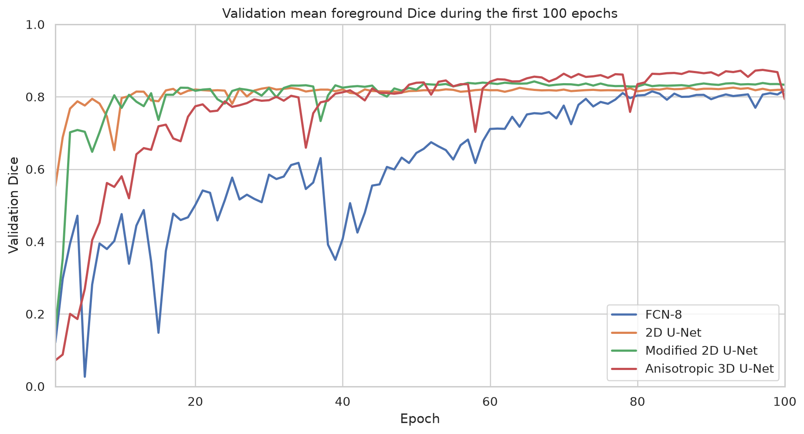

# Curated results

This folder is the compact, machine-readable summary used by the project
README. Full epoch histories, configurations, and per-volume rows remain in
`runs/`.

- `model_comparison.csv`: best selected run for each architecture
- `loss_ablation.csv`: weighted cross-entropy versus Dice loss for the modified
  2D U-Net

All Dice values are computed on 40 reconstructed validation volumes from 20
patients. They are not official ACDC test-set scores.

Historical distance columns under `runs/` used unit spacing because those
preprocessed files lacked physical spacing metadata. They are retained for
provenance but intentionally omitted from the curated comparison.

## Training figures

Detailed dashboards:

- [FCN-8](../docs/assets/fcn8_training_dashboard.png)
- [2D U-Net](../docs/assets/unet2d_training_dashboard.png)
- [Modified 2D U-Net](../docs/assets/unet2d_modified_training_dashboard.png)
- [Anisotropic 3D U-Net](../docs/assets/unet3d_training_dashboard.png)
